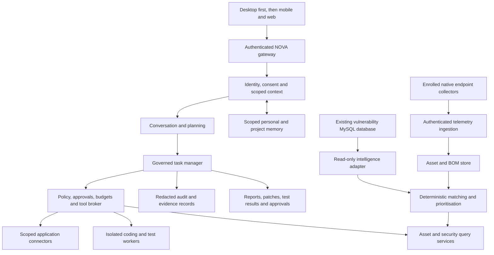

# NOVA Companion and Security Platform Roadmap

Date: 2026-09-09
Status: proposed delivery plan, not a claim that the capabilities below are implemented.

**Start here when resuming:** use [Execution Tracker](#9-execution-tracker) for task status and [Session Handoff](#10-session-handoff) for the next action. Sections 1-8 define the scope and acceptance criteria; sections 9-11 record execution. This is the single continuation file for this programme.

## 1. Product Goal

Build a personal AI companion that understands your chosen context, remembers useful facts with permission, helps complete tasks, and connects to your authorised devices, projects, and services. Extend the same governed platform into an asset and vulnerability intelligence sys tem using your existing MySQL CVE, KEV, and CVE-to-ransomware data.

The target is dependable and progressively more useful, not a promise of a perfect or conscious AI. NOVA should know when it lacks evidence, ask before consequential actions, and make its actions inspectable and reversible where possible.

Two product tracks share one foundation:

- **Companion and productivity:** conversation, voice, personal memory, connected applications, reminders, delegated coding, API validation, and approved automations.
- **Security intelligence:** enrolled endpoint collectors, scoped discovery, asset inventory, bills of materials, vulnerability matching, prioritisation, and supervised remediation.

"All my connections" means an explicit inventory of accounts, devices, repositories, services, and approved networks. It does not mean continuous recording of everything or permission to monitor other people. Listening, screen capture, communications ingestion, and work-system access each need their own consent and scope.

## 2. Starting Point

These are implementation anchors, not production-readiness certifications:

| Area | Existing foundation | Main gap |
| --- | --- | --- |
| Desktop | Sibling `nova-desktop` React/Tauri UI, chat, voice controls, reports, memory view | Clean typecheck, reliable live workflows, complete task/system views |
| Companion | Brain, conversation, voice, context, personality, memory services | Consistent identity, consent, durable structured memory, measured quality |
| Governed agents | Manager, broker, budgets, approvals, cancellation, evidence and audit; read-only research workflow | Proven write-capable tools, isolated coding execution, durable job recovery |
| Research | Saved reports, citations and image references | Provider reliability, relevance evaluation, verified external-image loading |
| Endpoint monitoring | [Native security agent](../scripts/security_agent.py), heartbeat and collector pipeline | Fleet enrollment lifecycle, hardened deployment and cross-platform validation |
| Inventory | Existing SBOM, CBOM, HBOM, host and scoped discovery collector hooks | Standards conformance, completeness, reconciliation and durable asset identity |
| Correlation | Existing local KEV/EPSS correlation tests | Connect and validate your actual MySQL intelligence data |

Known baseline risks include 59 remaining desktop TypeScript errors (remeasured 2026-09-10 after the first P0 repairs), voice behavior requiring live revalidation, and external image-network failures. Recent focused tests do not establish whole-product reliability. Existing security documents describe different historical phase numbers; this roadmap uses P0-P10 to avoid treating them as equivalent milestones.

Read alongside [the laptop delivery roadmap](ROADMAP.md), [Security Center design](SECURITY.md), [backend overview](BACKEND_SYSTEM_OVERVIEW.md), and [agent runtime constitution](agent_runtime/CONSTITUTION.md). Existing invariants remain binding.

## 3. Target Architecture

An endpoint collector is not an LLM agent. The collector gathers permitted telemetry with bounded resource use. NOVA's task agents analyse evidence and propose work centrally. Endpoints do not receive an unrestricted shell or dynamically generated agent code.

Keep personal memory, company project data, endpoint telemetry, and global vulnerability intelligence logically separated, with explicit workspace and asset authorisation on every query. Do not send private code, communications, or telemetry to cloud models without an approved data policy.

## 4. Delivery Sequence

Dependencies: `P0 -> P1 -> P2`. Then prioritise `P3 -> P4` for daily usefulness and `P5 -> P6 -> P7 -> P8` for security. P7 schema design can run alongside P5/P6, but useful asset matching requires P6 inventory. P9 depends on trustworthy earlier workflows. P10 is the wider rollout gate.

Continue the existing laptop-first rule: demonstrate each milestone locally, fix critical failures, and get owner acceptance before expanding deployment. The phase numbers are dependency order, not one-week sprints. Estimate dates after P0 establishes hardware, team capacity, supported platforms, and pilot size.

### P0. Reliability and Product Contracts

**Deliver:** reproducible backend/desktop startup, clean frontend build, API contract checks, safe isolated test data, health diagnostics, provider failure states, trace IDs, and an agreed task/connection/asset vocabulary. Benchmark voice latency, interruption, research completion, memory retrieval, and local model capacity before choosing larger models.

**Gate:** clean required CI checks; chat, voice, research, saved reports and memory pass end-to-end tests; no tests mutate real enrollments or user records; cancellation meets the existing two-second runtime invariant; backup restoration works in a clean environment. Publish measured limitations rather than fake progress or success.

**Demo:** start NOVA, complete a research job, reopen its report, interrupt speech, disconnect a provider, and recover without losing state.

### P1. Identity, Consent and Connections

**Deliver:** a connection registry for devices, repositories, accounts and services, recording owner, workspace, scopes, credentials handle, sync status, last successful contact and revoke controls. Use OS credential storage or a dedicated secrets service, OAuth where available, and authenticated sessions. Personal and employer workspaces must not share permissions implicitly.

**Gate:** a connector cannot read outside its approved scope; revocation blocks subsequent access and scheduled jobs; secrets never enter prompts or logs; disconnected and stale connections are visible. Speaker or face recognition is a convenience signal, not sufficient authorisation for sensitive operations.

**Demo:** connect one chosen local repository read-only, show exactly what is accessible, and revoke it. Add calendar read access next, not every account at once.

### P2. Personal Memory and Companion Quality

**Deliver:** separate conversational history, explicit profile facts, inferred preferences, goals, project decisions and short-lived context. Each durable memory has provenance, workspace, confidence, timestamps, expiry and user controls. Add review/correct/forget/export, conflict handling, and retrieval explanations. Do not infer personal identity from search-image similarity or name matches.

Voice work includes stable British male/female selections, push-to-talk, interruption, local wake-word controls and audible evaluation. Start with interaction-derived context; microphone, screen and communications capture remain off until specifically enabled, with visible indicators and retention limits.

**Gate:** a curated memory evaluation distinguishes known facts from guesses, prevents cross-workspace recall and stale-fact assertions, and verifies deletion from active stores and retrieval indexes. Document backup retention and deletion propagation. Personal content does not go into immutable audit payloads; preserve redacted action metadata instead.

**Demo:** NOVA recalls an approved project preference, cites where it learned it, accepts a correction, then forgets it on request.

### P3. Reliable Task Delegation

**Deliver:** a real task workspace with goal, scope, dependencies, budgets, approval state, progress evidence, artifacts, retry history and outcome. Add durable scheduling, leases, idempotency, restart recovery, dead-letter handling and deterministic verification. Wrap existing actions with structured tool contracts before granting write capabilities.

Define registered planner, researcher, implementer and verifier roles. Only the manager creates tasks; no agent grants itself capabilities or spawns other agents. An interrupted external write is "outcome unknown" until reconciled, not automatically retried.

**Gate:** restart mid-job does not duplicate a side effect; budget exhaustion stops work; cancellation prevents new actions; changed actions invalidate approvals; the executor cannot self-certify success. Failure summaries identify what actually ran and what remains unverified.

**Demo:** "Research this task, draft a plan and prepare a change for review" yields a resumable task with evidence and no unapproved external writes.

### P4. Coding Assistant and API Validation

**Deliver:** repository-scoped indexing and an isolated worker using a disposable worktree or copy. Detect the project's framework and tests rather than imposing a new stack. Produce implementation, migrations when needed, OpenAPI updates, tests, a reviewed diff and a concise execution report.

Test coverage includes request/response schemas, required fields, invalid types, limits, authentication, authorisation, pagination, idempotency, timeouts and error handling as applicable. Use the project's own test tools plus OpenAPI-based testing such as Schemathesis when suitable. Run destructive API tests only against disposable fixtures or explicitly approved non-production targets.

**Gate:** malicious repository instructions cannot escape scope; symlinks and path traversal cannot escape the worker; secrets and production databases are unavailable by default; unrelated dirty changes survive; independent tests and diff review pass. Package scripts and tests are executable untrusted code and need process, filesystem, network and resource isolation. Installing dependencies, opening a PR, merging and deploying are separate governed actions.

**Demo:** "Add an API to my existing project and test its validations" produces an approved contract, patch, endpoint inventory, test matrix, test logs, known gaps and rollback instructions. "Test every API" reports discovered versus tested endpoints and exclusions, not an unsupported 100% claim.

### P5. Enrolled Endpoint Fleet

**Deliver:** harden the existing native agent instead of replacing it. Pilot one Linux machine and one Mac before Windows. Add short-lived enrollment credentials, per-device identity, mutual TLS, key rotation/revocation, signed versioned payloads, replay protection, bounded offline spool, heartbeat status, signed upgrades and uninstall.

Prefer outbound-only connections from endpoints. Expose collectors by explicit capability and use least privilege. Endpoint software is installed by an authorised administrator; NOVA never self-propagates to discovered machines.

**Gate:** rogue, revoked and replayed messages are rejected; offline buffering and ingestion deduplication work; upgrade rollback is demonstrated; resource budgets are measured; missed heartbeats produce "stale/offline," not "healthy." No arbitrary remote command channel is added as a shortcut.

**Demo:** enroll two owned machines, disconnect one, reconcile its buffered telemetry, and revoke it without affecting the other.

### P6. Asset Discovery and Bills of Materials

**Deliver:** unified inventory for hosts, software, services, containers and approved network assets, with stable IDs, owner, environment, zone, exposure evidence, first/last seen and provenance. Reconcile ephemeral IPs, duplicate observations and device replacement without merging distinct assets.

Start with host-local and passive collection. Active probing requires an allowlist, explicit authorisation, rate limits and a maintenance policy. OT/ICS remains a separately approved passive-first track; do not transfer IT scanning defaults into sensitive operational networks.

BOM scope:

- **SBOM:** package identity, version, ecosystem, package URL (purl), dependency relationships, hashes and build/runtime context. Use established generators such as Syft and validate CycloneDX or SPDX documents.
- **HBOM:** hardware, firmware, model identifiers and support lifecycle when observable; mark unavailable fields explicitly.
- **CBOM:** cryptographic assets, algorithms, certificates and lifecycle metadata; do not collect private keys. This extends the repository's existing CBOM hooks.
- **Optional later BOMs:** SaaS/service or AI model/data inventories only after their use cases and formats are agreed.

**Gate:** controlled fixtures validate BOM schemas, package coverage and diffs; denied networks receive no probes; incomplete inventory is marked incomplete. A BOM records components; it is not proof that vulnerabilities are reachable or exploitable.

**Demo:** "What changed on this machine?" returns an attributed asset/BOM diff rather than a raw, unbounded process dump.

### P7. MySQL Vulnerability Intelligence

**Deliver:** connect your existing database through a read-only, parameterised query adapter with pooling, bounded queries, timeouts and a dedicated least-privilege account. First inspect a redacted schema and sample records; do not assume table names, CVE completeness, ransomware taxonomy, update cadence or feed licensing.

Build a canonical projection of CVEs, affected products/version ranges, vendor advisories, CVSS version/vector, KEV entries, ransomware associations, references, source dates and ingestion dates. Preserve rejected/withdrawn CVEs, aliases and conflicting evidence. EPSS is an optional additional feed, not assumed to exist in your database.

Match deterministically using package ecosystem, purl/CPE where appropriate, vendor/product identity, version intervals and OS-distribution advisories. Handle distro backports, epochs and package revisions with established ecosystem parsers and advisory sources; do not compare every version as generic SemVer. Use an existing matcher/scanner such as Grype or an ecosystem-specific engine where it fits, with your MySQL adapter enriching results. LLMs explain matches; they do not invent them or execute arbitrary SQL.

**Gate:** a labelled corpus covers affected, unaffected, ambiguous, missing-version, backported and withdrawn cases. Each finding includes matched component, matching rule, advisory evidence, confidence, source freshness and affected/fixed status. Measure precision and recall by ecosystem; suppress automated remediation on uncertain matches.

**Demo:** "Which of my assets contain components associated with KEV-listed CVEs or known ransomware activity?" returns evidence-backed matches and explicit unknowns. A ransomware association does not mean the endpoint is infected.

### P8. Risk Prioritisation and Investigation

**Deliver:** explainable prioritisation combining match confidence, KEV, ransomware association, optional EPSS, CVSS, observed exposure, asset criticality and compensating controls. Separate vulnerability severity, exploitation intelligence, environment risk and incident evidence instead of collapsing them into an unexplained score.

Add finding lifecycle, owner, ticket integration, suppression with reason/expiry, investigation timelines, new-risk notifications and remediation recommendations. Unknown reachability must not be silently treated as unreachable or removed from the findings list.

**Gate:** every priority has a reproducible rule version and supporting evidence; stale feeds are visible; repeated telemetry does not create alert storms; no vulnerability match alone is labelled an active compromise. Analysts can challenge and correct the result.

**Demo:** "What should I fix first and why?" gives a short ranked worklist linked to affected assets, versions, source records and the proposed next action.

### P9. Proactive Assistance and Supervised Remediation

**Deliver:** event-driven suggestions, scheduled briefings, follow-ups and delegated runbooks. NOVA can notice changed assets, overdue approved goals, failed builds or new relevant CVEs without continuous unrestricted model activity. Add quiet hours, notification budgets, explanation of why an alert was raised and feedback controls.

Introduce autonomy gradually: on-demand read-only work; approved scheduled read-only monitoring; sandboxed proposals; then tightly bounded reversible writes. Standing permission is a revocable, scoped user policy. It cannot replace the constitution's required single-use, action-bound approvals for approval-gated operations.

**Gate:** dry runs identify impact; backups and rollback are verified; production changes require exact approval and a maintenance window where relevant; post-action verification checks the actual endpoint state. Failed verification halts the runbook. Endpoint actions use authenticated, signed, expiring, allowlisted jobs, not generated shell commands.

**Demo:** NOVA detects a relevant vulnerability, proposes a fix, prepares a coding change and tests it, waits for approval, then verifies the approved rollout. Start with a disposable lab, never production.

### P10. Everywhere Access and Operational Readiness

**Deliver:** authenticated mobile/web access, cross-device task continuity, push notifications, secure remote connectivity and device-session revocation. Use private networking or a hardened gateway; do not expose the existing local development API directly to the internet. Add Windows collectors only after Linux/Mac pilot gates pass.

Add telemetry and inference backpressure, queue fairness, database migrations, backup/restore drills, model/version rollback, fleet update channels, retention controls and operational runbooks. Separate the personal pilot from any enterprise rollout requiring tenant isolation, SSO/RBAC, customer data boundaries and contractual compliance.

**Gate:** unauthorised clients and cross-workspace queries are denied; mobile approval binds to the same exact action; disconnect/reconnect preserves task truth; capacity tests meet an agreed pilot load and latency/error budget. Complete an independent security review before wider access.

**Demo:** ask on the phone, inspect the same evidence-backed task on the Mac, approve a scoped action, and see a verified result without sharing raw endpoint credentials.

## 5. Data and Agent Contracts

| Contract | Minimum fields |
| --- | --- |
| Connection | ID, owner/workspace, type, scopes, credential handle, consent, status, freshness |
| Memory | ID, workspace, fact/type, provenance, confidence, created/confirmed/expiry times, consent |
| Task | ID, goal, workspace, exact resource scope, agent role, budgets, approvals, state, artifacts |
| Endpoint | Stable device ID, enrollment identity, OS, collector versions, capabilities, last seen |
| Observation | Endpoint/asset ID, collector, schema version, observed/received times, evidence digest |
| Component/BOM | Asset ID, BOM ID/hash, ecosystem, purl/CPE as available, version, dependency context |
| Vulnerability match | Component, CVE/advisory, match rule/version, status, confidence, source freshness |
| Finding/action | Owner, priority rationale, lifecycle, evidence, action fingerprint, approval, verification |

Use bounded structured tools: asset queries, vulnerability lookups, scoped repository reads/writes, approved test commands and signed endpoint jobs. Choose storage by need: keep MySQL as the supplied intelligence source, use existing transactional stores where sufficient, and add vector/graph/time-series infrastructure only after measured requirements justify it. Search indexes are derived views, not an authority for permissions or facts.

## 6. First Delivery Slice

Do not start with dozens of agents. Prove one personal workflow and one security workflow:

1. Complete P0 reliability checks and establish test isolation and baseline measurements.
2. Implement P1's connection registry with one read-only repository and one owned lab endpoint scope.
3. Add P2's explicit profile/project memories, provenance and correction/deletion workflow.
4. Build P3/P4's approval-to-patch-to-independent-test loop for one API in a disposable project copy.
5. Harden the existing endpoint enrollment path, collect a real SBOM, and inspect a redacted MySQL schema.
6. Implement one package-ecosystem matcher, enrich its findings with KEV/ransomware data, and render an evidence-backed report.

The first security vertical slice is: `owned Linux endpoint -> validated SBOM -> MySQL advisory match -> KEV/ransomware enrichment -> prioritised report`. The first productivity slice is: `approved repository -> API contract -> sandboxed patch -> independent tests -> reviewable diff`. Neither requires production auto-remediation.

## 7. Decisions Needed Before Scheduling

- Which connections come first: repositories, calendar, email, local documents, cloud accounts, or machines?
- Which repository/framework and disposable database will be the first coding/API pilot?
- What are the redacted MySQL schema, version fields, provenance, licensing, update cadence and approximate dataset size? Credentials stay outside chat and source control.
- Does BOM mean SBOM only first, or do CBOM/HBOM have immediate acceptance requirements?
- Which platforms, endpoint count, zones and discovery activities are explicitly authorised for the pilot?
- What data must stay local, and what employer policies govern code, communications and endpoint telemetry?
- Which exact actions may run unattended, and which always require approval?
- What are the available hardware, model latency targets, operating budget and engineering capacity?

## 8. Definition of a Dependable Companion

NOVA demonstrates reliable memory with user control, completes scoped tasks with verifiable artifacts, distinguishes facts from inference, inventories only authorised resources, explains vulnerability matches, and remains interruptible. It is useful when it can act, honest when it cannot, and never gains authority merely because an agent suggested an action.

## 9. Execution Tracker

Last updated: 2026-09-10.

Status values: `NOT_STARTED`, `IN_PROGRESS`, `BLOCKED`, `VERIFYING`, `ACCEPTED`.
An unchecked item is not yet verified against this roadmap, even if related code already exists. Check a task only after recording evidence in the work log. A phase becomes `ACCEPTED` only after its Section 4 gate, demo and owner acceptance are recorded. Do not infer completion from a previous session's summary alone.

| Phase | Status | Prerequisite |
| --- | --- | --- |
| P0 Reliability | IN_PROGRESS | First execution phase |
| P1 Connections | NOT_STARTED | P0 accepted |
| P2 Memory and companion | IN_PROGRESS: user-requested voice slice only | P1 acceptance still required for the full phase |
| P3 Task delegation | NOT_STARTED | P2 accepted |
| P4 Coding and API tests | NOT_STARTED | P3 accepted |
| P5 Endpoint fleet | NOT_STARTED | P0-P2 accepted; shared task contracts from P3 for delegated jobs |
| P6 Discovery and BOMs | NOT_STARTED | P5 accepted |
| P7 MySQL intelligence | NOT_STARTED | P6 inventory for matching; schema analysis may begin alongside P5/P6 |
| P8 Risk and investigation | NOT_STARTED | P7 accepted |
| P9 Proactive automation | NOT_STARTED | Relevant P3-P8 workflows accepted |
| P10 Everywhere access | NOT_STARTED | Prior workflows accepted for the intended rollout scope |

### P0 Checklist

- [x] P0-01: Reproduce current desktop type/build failures and record an isolated test baseline.
- [ ] P0-02: Resolve required build/contract failures without unrelated refactoring.
- [ ] P0-03: Isolate tests from real memories, speaker enrollments, credentials and databases.
- [ ] P0-04: Verify startup, chat, voice, research, reports, memory, provider failure and recovery journeys.
- [ ] P0-05: Measure latency/cancellation and prove backup restoration; document operating limits.
- [ ] P0-GATE: Section 4 acceptance criteria and demo verified; owner acceptance recorded.

### P1 Checklist

- [ ] P1-01: Define connection, workspace, ownership, scope and consent contracts.
- [ ] P1-02: Implement authenticated connection registry and secure credential handles.
- [ ] P1-03: Connect one approved repository read-only; implement status and revocation.
- [ ] P1-04: Test cross-workspace denial, scope enforcement, secret redaction and revoked scheduled access.
- [ ] P1-GATE: Section 4 acceptance criteria and demo verified; owner acceptance recorded.

### P2 Checklist

- [ ] P2-01: Define explicit facts, inferred preferences, goals and project memory with provenance/expiry.
- [ ] P2-02: Implement review, correction, export, deletion and retrieval explanations.
- [ ] P2-03: Evaluate memory accuracy, conflicts, isolation and deletion propagation.
- [ ] P2-04: Verify voice profiles, interruption, consent indicators and optional local wake-word flow.
- [ ] P2-05: After voice validation, open/close a visible camera side panel by explicit voice command; verify permission denial, indicator and capture shutdown.
- [ ] P2-06: Count raised fingers and evaluate a bounded set of gestures/visible activities with confidence, unknown states and measured latency under varied lighting.
- [ ] P2-07: Offer optional, tentative descriptions of visible expression cues; never present inferred emotion as a fact or use it for consequential decisions.
- [ ] P2-08: Capture a photo only on explicit request; show the result and storage location, with review/delete controls and an agreed retention policy.
- [ ] P2-GATE: Section 4 acceptance criteria and demo verified; owner acceptance recorded.

### P3 Checklist

- [ ] P3-01: Build durable task state and a real task UI with evidence and artifacts.
- [ ] P3-02: Implement leases, idempotency, restart recovery and uncertain-outcome reconciliation.
- [ ] P3-03: Add structured tool contracts and registered role/capability definitions before enabling writes.
- [ ] P3-04: Verify bounded approvals, cancellation, budgets and independent result verification.
- [ ] P3-GATE: Section 4 acceptance criteria and demo verified; owner acceptance recorded.

### P4 Checklist

- [ ] P4-01: Select an approved pilot repository and disposable database; define worker isolation.
- [ ] P4-02: Implement scoped repository inspection, API-contract planning and sandboxed patch generation.
- [ ] P4-03: Add endpoint inventory and applicable validation/auth/error tests with independent execution.
- [ ] P4-04: Deliver reviewed diff, test evidence, exclusions and rollback; verify no production/secret access.
- [ ] P4-GATE: Section 4 acceptance criteria and demo verified; owner acceptance recorded.

### P5 Checklist

- [ ] P5-01: Review existing agent transport/collectors and authorise one Linux and one Mac pilot.
- [ ] P5-02: Implement enrollment, per-device identity, mutual TLS, rotation and revocation.
- [ ] P5-03: Verify signed telemetry, replay rejection, offline spool and ingestion deduplication.
- [ ] P5-04: Measure resource limits and test signed upgrade, rollback, stale status and uninstall.
- [ ] P5-GATE: Section 4 acceptance criteria and demo verified; owner acceptance recorded.

### P6 Checklist

- [ ] P6-01: Implement stable asset identity, ownership, zones and observation reconciliation.
- [ ] P6-02: Validate host-local/passive discovery; enforce separate authorisation for active probes.
- [ ] P6-03: Validate SBOM generation/import and schema conformance; agree HBOM/CBOM pilot scope.
- [ ] P6-04: Verify inventory completeness reporting, BOM diffs and denied-network protection.
- [ ] P6-GATE: Section 4 acceptance criteria and demo verified; owner acceptance recorded.

### P7 Checklist

- [ ] P7-01: Review redacted MySQL schema, sample data, feed provenance, freshness and licensing.
- [ ] P7-02: Implement read-only bounded intelligence adapter and canonical CVE/KEV/ransomware projection.
- [ ] P7-03: Match one package ecosystem using deterministic version/advisory rules and inventory evidence.
- [ ] P7-04: Evaluate affected/unaffected/unknown/backported/withdrawn cases and preserve confidence/freshness.
- [ ] P7-GATE: Section 4 acceptance criteria and demo verified; owner acceptance recorded.

### P8 Checklist

- [ ] P8-01: Define reproducible risk rules separating severity, exploitation evidence and exposure.
- [ ] P8-02: Implement finding ownership, lifecycle, deduplication and expiring suppressions.
- [ ] P8-03: Add evidence-linked investigations, prioritised worklists and approved ticket integration.
- [ ] P8-04: Verify stale feeds, unknown reachability and challenge/correction workflows.
- [ ] P8-GATE: Section 4 acceptance criteria and demo verified; owner acceptance recorded.

### P9 Checklist

- [ ] P9-01: Implement scoped schedules, event triggers, quiet hours and notification budgets.
- [ ] P9-02: Add dry-run proposals and explicitly approved, bounded automation policies.
- [ ] P9-03: Implement signed expiring endpoint jobs with rollback and post-action verification.
- [ ] P9-04: Demonstrate a lab remediation; verify revoked permission and failed verification halt execution.
- [ ] P9-GATE: Section 4 acceptance criteria and demo verified; owner acceptance recorded.

### P10 Checklist

- [ ] P10-01: Implement authenticated mobile/web access without exposing local development APIs.
- [ ] P10-02: Verify cross-device task continuity, notifications and exact-action approvals.
- [ ] P10-03: Validate capacity, retention, recovery, fleet updates and any approved Windows expansion.
- [ ] P10-04: Complete access-isolation tests, operational runbooks and independent security review.
- [ ] P10-GATE: Section 4 acceptance criteria and demo verified; owner acceptance recorded.

## 10. Session Handoff

Update this section after each implementation session, including incomplete or failed work.

| Field | Current record |
| --- | --- |
| Current phase/task | P0 / P0-02 in progress; P0-01 baseline recorded; earlier P2 voice slice still awaits hardware acceptance |
| Last completed action | Broader multi-provider retrieval with explicit lexical relevance scores and bounded task-owned HTML page reads. Coverage distinguishes snippets, downloaded/supplied extracts and denied/unavailable attempts. 343 backend tests and 90 desktop tests passed; simulated desktop/mobile coverage checked. No backend restart |
| Next exact action | Owner verifies the running backend has loaded the changes (reload only if needed), then runs representative relevance/page-reading questions and checks Coverage and citations. Validate the pending explicit-file nova-desktop review too. Live page retrieval, model correctness and visual identity remain unverified; P0-02 build work and phase acceptance remain open |
| Previously observed baseline | Production build initially failed at 70 TypeScript errors; 59 remain. Desktop tests: 40 baseline, 56 passing after music integration; focused backend music/voice suite: 118 passing |
| Changes pending verification | Clean production build, broader test isolation and live P0 journeys; actual microphone/accent performance and speaker playback remain unverified; camera stage not implemented |
| Decisions pending | Pilot repository selected: nova-desktop, read-only. Endpoint scope, BOM priorities, MySQL schema and data policy remain pending; see Section 7 |
| Immediate blocker | Missing Gmail, face/identity and security API types and settings block the desktop build; external access later requires explicit scope and credentials configured outside chat |
| Backend ownership | User starts/reloads/stops the main backend; do not change its lifecycle without permission |
| Working-tree safety | Preserve existing user changes; isolate tests from live data; never commit or create branches without authorisation |
| Phase acceptance | No P0-P10 phase accepted yet |

Suggested continuation prompt:

> Continue NOVA using docs/COMPANION_PLATFORM_ROADMAP.md. Read the Execution Tracker and Session Handoff, verify the current state, and start the next unchecked task in the current phase. Follow the agent runtime constitution, preserve user changes, do not restart the main backend, and update the tracker with changes, test evidence, blockers and the next action before finishing. Do not advance to the next phase without acceptance.

## 11. Work Log

For implementation entries, record date, phase/task IDs, changed files, exact checks and outcomes, unresolved risks, owner acceptance where applicable, and next action. Link evidence artifacts when available; never record secrets or raw private telemetry here.

### 2026-09-17: Scored Search and Bounded Page Reading

- Scope: user-requested research improvement within the ongoing P0/P3 slice; no phase advancement. Text retrieval now requests up to 20 candidates from each of four providers concurrently; image candidates from two providers are ranked after source alignment. Scores are lexical matches against the original question, with matched/missing terms, not truth or visual-confidence scores.
- Retrieval: [page tool](../services/tools/web_page_tool.py) adds bounded public HTTPS HTML extraction with robots enforcement, all-address DNS checks, pinned connections, same-host redirect checks, byte/MIME/time limits and no cookies/proxy inheritance. Static startup grants and [broker](../services/agent_runtime/broker.py) enforce same-task search discovery and mint untrusted page evidence. Up to seven searches plus four page attempts stay inside the existing 11-call graph budget. No recursive crawl, PDF/browser execution, shell or writes.
- Reports: [research agent](../services/agent_runtime/agents/research_agent.py) preserves the 14,000-character evidence ceiling and records page outcomes; [reports](../services/agent_runtime/reports.py) persist coverage without raw extracts. Native reports distinguish downloaded, model-supplied, truncated and unavailable/denied attempts, while old reports remain readable. Added lxml to declared dependencies.
- Checks: `PYTHONDONTWRITEBYTECODE=1 .venv/bin/python -m pytest -p no:cacheprovider tests/test_agent_runtime_*.py tests/test_web_search_structured.py tests/test_repository_read_tool.py tests/test_web_page_tool.py -q` passed 343 tests. `npm --prefix ../nova-desktop test` passed 90 tests. Offline graph fixtures verify page citations, partial snippet fallback, persistence and budgets. Native simulated coverage screenshots checked at 1440x1000 and 390x844, with no horizontal overflow; fixtures removed. Touched implementation files have no editor diagnostics.
- Limits/next: no live model research, public-page retrieval or backend lifecycle operation performed. Main backend remains owner-controlled. Full production build was not rerun; previously recorded 59 TypeScript errors remain a separate blocker. HTML extracts may omit relevant later sections; citation ownership and lexical relevance do not establish factual support. Owner acceptance and all phase gates remain open.

### 2026-09-17: Research Image Relevance

- Root cause: image search admitted safe thumbnail URLs without tying the candidates to text sources, and reports published images independently of cited findings. This let unrelated image results appear alongside useful Atlas/Scout text.
- Changes: [image policy](../services/agent_runtime/policy/image_policy.py) and [search tool](../services/tools/web_search_tool.py) require exact text-source pages and source-title overlap, numeric identifiers and quoted-query matches. [Report builder](../services/agent_runtime/reports.py) requires the same task to cite that image's source page. Native ResearchReports filters old candidates against cited findings without rewriting history; loading stays opt-in and unmatched reports show no images.
- Checks: `PYTHONDONTWRITEBYTECODE=1 .venv/bin/python -m pytest -p no:cacheprovider tests/test_agent_runtime_*.py tests/test_web_search_structured.py tests/test_repository_read_tool.py -q` passed 313 tests; `npm --prefix ../nova-desktop test` passed 88 tests. Regression cases cover unrelated sites/pages, wrong numeric models, quoted-name mismatches, uncited sources, empty findings and text preservation. Touched files have no editor diagnostics. The open port-1420 report displayed no matched images, zero loaded images and no horizontal overflow.
- Limits: source/title matching is conservative and is not visual verification. No live query, source image download, saved-report rewrite or backend lifecycle change. Backend reload is owner-controlled; production build's previously recorded 59-error baseline was not rechecked in this slice. No phase advancement.

### 2026-09-17: Governed Repository Review Workflow

- Scope: completed the selected nova-desktop pilot's explicit-file workflow. Separate startup-only repo.read grant, manager-owned Repo Reader graph, exact task-file scope checks, broker-minted file_content evidence and metered local-model calls. Existing research grants remain unchanged. No general filesystem routing, shell, edits or repository enumeration.
- Persistence/API: existing report storage now retains scope, file references/digests and findings; raw file snapshots are not saved. Scope is saved before acknowledgement; interrupted submission is cancelled, and storage failures do not schedule work. Local-only endpoint rejects other repository identities, extra fields and oversized file lists. Native Agents includes Repository review mode, availability gating, exact file inputs, report navigation and non-navigating file citations.
- Verification: `PYTHONDONTWRITEBYTECODE=1 .venv/bin/python -m pytest -p no:cacheprovider tests/test_agent_runtime_*.py tests/test_repository_read_tool.py -q` passed 292 tests. `npm --prefix ../nova-desktop test` passed 86 tests; final availability-copy change rechecked with eight Agents tests. Browser on port 1420 verified traversal rejection, exact submitted scope, saved report navigation and file citations with no horizontal overflow at 1440x1000 and 390x844; screenshots inspected. All browser endpoints were simulated; no real job or source disclosure to a model.
- Build/limits: production build remains blocked by 59 pre-existing TypeScript errors. Main backend lifecycle remained owner-controlled. Startup registration and real model output require owner validation after reload; secret detection is heuristic and citation checks do not prove factual correctness. No phase acceptance or write-enabled workers.

### 2026-09-17: Read-Only Repository Boundary

- Scope: user selected `nova-desktop` as the pilot. Added [repository read tool](../services/tools/repository_read_tool.py) and [offline tests](../tests/test_repository_read_tool.py). Trusted-root injection, explicit relative paths, descriptor-relative no-symlink reads, size/type/hardlink checks, changed-file detection, content digests and conservative secret checks; no discovery, shell, writes or network.
- Verification: `PYTHONDONTWRITEBYTECODE=1 .venv/bin/python -m pytest -p no:cacheprovider tests/test_repository_read_tool.py tests/test_agent_runtime_phase1.py -q` passed 57 tests, including 31 reader cases. Initial tests used unavailable pytest-asyncio; corrected to synchronous tests with asyncio.run. All reads used temporary fixtures, not pilot repository contents.
- Limits/next: tool remains unregistered and ungranted. Secret filtering is heuristic. Add broker-owned file evidence, durable scoped task/artifacts and a scope-bound Agents workflow before enabling a developer agent. No backend restart, real project analysis or phase acceptance.

### 2026-09-17: Native Agents Task Announcements

- Scope: accessible status and optional local English speech in the existing port-1420 Agents view, following the user's clarification that NOVA is the desktop frontend. Updated sibling desktop `src/pages/AgentsPage.tsx` and its existing test file; no backend lifecycle changes or coding-worker grants.
- Checks: focused Agents tests passed 7 tests; `npm --prefix ../nova-desktop test` passed all 84 tests. Both touched files have no editor diagnostics. Production build remains blocked by 59 existing TypeScript errors outside these files.
- Browser: simulated status and intercepted speech on port 1420 verified keyboard activation, default-off speech, duplicate suppression, partial wording and unavailable status after connection loss. Desktop 1440x1000 and mobile 390x844 screenshots inspected with no horizontal overflow. The embedded browser reported hidden pages; visibility was simulated only in the test tab to permit polling. No real jobs or audio were started.
- Limits/next: actual VoiceOver, local audible speech and live backend integration remain unverified. Speech is separate from desktop Speak Back. Owner acceptance and existing build-contract work remain open; no phase advancement.

### 2026-09-17: Natural Delegation, Task Accessibility and Local Game

- Scope: requested P0/P3 usability slice and proposed P3/P4 developer-agent design; no phase advancement. Ordinary search phrases, Google/find-out forms and natural progress/results commands now use the shared chat/voice router. Local-resource exclusions also apply to explicit research delegation. Capability replies distinguish actual research and the local game from unimplemented coding actions.
- Added [Arcade developer quiz](../services/games/developer_quiz.py) through the shared [conversation service](../packages/application/conversation_service.py): five sampled questions, deterministic scores/explanations, repeat/skip/stop, no model or tools. This is single-user process-local conversation state, not a governed agent or durable job.
- Updated [agent monitor](../services/gateway/ui/agents.html) and [monitor script](../services/gateway/ui/agents.js) with change-only screen-reader announcements and optional local English browser speech. User clarified that screen reader means accessible task updates, not screen capture; no capture functionality or permissions added.
- Extended the existing [agent roadmap](agent_runtime/DEEP_RESEARCH.md) with repository reader, planner, debugger, sandboxed patch builder, independent QA/reviewer, API validation, docs, dependency and organizer roles; exact approval and task/artifact gates are explicit. These developer workers are proposed, not enabled.
- Checks: `node --check services/gateway/ui/agents.js` passed; `PYTHONDONTWRITEBYTECODE=1 .venv/bin/python -m pytest -p no:cacheprovider tests/test_agent_runtime_*.py tests/test_web_search_structured.py tests/test_developer_quiz.py tests/test_voice_conversation_turns.py -q` passed 304 tests. Simulated browser tests verified keyboard speech toggle, default-off behavior, duplicate suppression, partial-outcome wording, remote-voice rejection and no overflow at 1440x1000/390x844. Screenshots inspected; no actual audio, model job, microphone or project mutation performed by the checks.
- Limits/next: main backend `/agents` timed out; lifecycle remained owner-controlled. Reload for the new conversation features and validate the live desktop plus audible updates. Game state is not multi-user isolated. Coding agents require approved scope and an isolated worker; no shell/write grants were enabled. No P0-P10 gate accepted.

### 2026-09-16: User-Requested Research Reliability and Relevance

- Scope: P0-04 research reliability slice; no phase acceptance. Added schema-constrained Ollama requests, safe model-error propagation into reports, original-question prompts, topic-sensitive query expansion, bounded wider source review, fallback search providers and quoted-entity filtering. Independent researchers no longer cancel each other on ordinary task failure; synthesis is skipped if required inputs fail. Removed the prior unbudgeted schema-repair retry. Budget, cancellation and citation protections remain enforced.
- Implementation: [research agent](../services/agent_runtime/agents/research_agent.py), [search tool](../services/tools/web_search_tool.py), [model adapter](../services/agent_runtime/models/ollama.py), [model failure contract](../services/agent_runtime/contracts/model_usage.py), [runtime service](../services/agent_runtime/service.py), [manager](../services/agent_runtime/manager.py) and [reports](../services/agent_runtime/reports.py). Existing research, model, reports, phase-one and search tests updated; see [research behavior and limits](agent_runtime/DEEP_RESEARCH.md).
- Verification: `PYTHONDONTWRITEBYTECODE=1 .venv/bin/python -m pytest -p no:cacheprovider tests/test_agent_runtime_*.py tests/test_web_search_structured.py -q` passed 245 tests. Isolated live public research completed all three tasks with 17 findings, 18 sources, 11 searches and a valid audit chain. Atlas succeeded; Scout and Prism remained partial due to three provider failures. An initial live grammar rejection from added field-length limits was repaired and rechecked before the final live run.
- Limits: main backend status timed out; it was not restarted. Live checks did not write user reports or persistent audit records. Agents still use configured Qwen/Ollama; chat uses Gemma 4. Search snippets are not full-page verification, and relevance instructions are not proof of factual correctness or exhaustive coverage. Provider failures remain visible rather than relabelled as success.
- Next: owner reloads the backend and checks representative research questions and failure messages. Continue the existing P0-02 build-contract work afterward. No P0-P10 gate is accepted by this entry.

### 2026-09-09: Planning Baseline

- Scope: documented P0-P10 goals, dependencies, acceptance gates, demos and execution checklists.
- Files: this roadmap and its entry link in [ROADMAP.md](ROADMAP.md).
- Verification: local document links, phase coverage, checkbox IDs and Markdown structure checked.
- Result: planning complete; implementation checkboxes intentionally remain unchecked.
- Next: P0-01, reproduce and record the desktop build/type baseline.

### 2026-09-09: User-Requested Voice Turn-Taking

- Scope: targeted P2-04 work requested ahead of the full phase gates. Other phase prerequisites remain unchanged.
- Wake recognition: shared prefix matching in [wakeword.py](../services/voice/wakeword.py) and [stream.py](../services/voice/stream.py) accepts Nova and greeting-prefixed Novah, Nowa, No va, N ova, including merged HeyNova. Broad fuzzy matches such as "never" and "over" are intentionally rejected. This tolerates transcription variants; it is not accent-model training.
- Conversation: the desktop keeps microphone capture connected during speech. A distinct recognized follow-up stops playback before forwarding the transcript; questions arriving during reasoning queue without duplicating or cancelling the underlying action. Chat-initiated speech also opens a follow-up window when the microphone is already enabled.
- Playback: [tts.py](../services/voice/tts.py) rejects cancelled synthesis/preparation, guards playback start and stops owned fallback processes. The speech endpoint waits for completion and returns actual success/interruption. Frontend turn ownership prevents old speech completion and caption timers from overwriting a newer turn.
- Backend check: `.venv/bin/python -m pytest tests/test_voice_conversation_turns.py tests/test_voice_tts_delivery.py tests/test_voice_wakeword.py -q` passed 53 tests. Tests cover wake false triggers, echo/follow-up classification, stop-before-transcript ordering, synthesis/preparation cancellation, concurrent playback interruption and endpoint completion.
- Desktop check: `npm --prefix ../nova-desktop test -- src/hooks/voiceTurns.test.tsx src/services/voicePlayback.test.ts` passed 8 tests using fake microphone/audio/API implementations. No real microphone, camera, speaker enrollment or live action was used.
- Final regression: `npm --prefix ../nova-desktop test -- --run` passed all 37 desktop tests. Desktop `tsc -b` still reports 70 pre-existing errors after fixing four local wake-queue narrowing errors; no new voice test diagnostics. The existing dev server on port 1420 returned HTTP 200. Main backend was not restarted.
- Limits: interruption currently waits for an STT utterance, normally a 1.2-second silence plus decoding. Continuous overlapping speaker audio may delay segmentation up to the 15-second buffer cap. Text echo filtering is heuristic, not acoustic echo cancellation; short interjections are preserved and can produce false interruptions. A headset is the first validation configuration, followed by laptop-speaker testing. Do not claim instantaneous or production-validated speakerphone interruption.
- Manual acceptance: enable Voice and hands-free listening; say "Hey Nova, explain the plan"; during its reply say "Wait, include Friday too" without a new wake word. Check the old audio stops, one follow-up appears, and old captions do not return. Repeat while NOVA is thinking, after a typed chat reply, with mic disabled, and using "stop listening". Record misses/false triggers and timing for the user's accent.
- Camera stage: P2-05 through P2-08 are backlog only. No camera access, gesture inference, emotion inference or photo capture was added here. Main backend lifecycle remains user-owned; no phase accepted.

### 2026-09-10: P0 Baseline and First Contract Repairs

- P0-01 complete: `npm --prefix ../nova-desktop run build` reproduced 70 TypeScript errors and stopped before Vite bundling. `npm --prefix ../nova-desktop test -- --run` passed the baseline 40 tests across 12 files using existing mocked services. This establishes the desktop test baseline, not isolation of the entire backend suite; P0-03 remains open.
- P0-02 started: restored the missing `NovaStatus.musicPlaying` boolean and its false initial value in the desktop shared types/store. Nine consumer compile errors disappeared without suppressing TypeScript checks.
- Found a behavior defect while repairing the next two errors: the voice gateway omitted the music tool's `success` and `playback_state`. Added nullable response fields and forwarded actual results in [routes.py](../services/gateway/routes.py); desktop voice/chat now update playback state only for a confirmed `playing`/`paused` state and do not change it on explicit failure. No tool execution or authorization rules changed.
- Regression evidence: nine new desktop cases cover successful, failed, missing and unknown outcomes; three gateway cases verify serialization of successful play/pause and failed playback with a fake engine and no audio. The scoped gateway tests replace route collaborators; broader legacy registry import side effects still need P0-03 isolation.
- Checks: `npm --prefix ../nova-desktop test -- src/hooks/voiceTurns.test.tsx` passed 15 tests; `.venv/bin/python -m pytest -p no:cacheprovider tests/test_voice_conversation_turns.py -q` with `PYTHONDONTWRITEBYTECODE=1` passed 29 tests. The earlier conversation/delivery run passed 59 tests before adding the three gateway cases.
- Final desktop regression: `npm --prefix ../nova-desktop test -- --run` passed all 49 tests. `../nova-desktop/node_modules/.bin/tsc -b ../nova-desktop --pretty false` still fails with 59 errors, down from 70; no errors remain in the touched voice/chat/status slice. The production build is NOT clean and P0-02 is not complete.
- Remaining error groups: missing Gmail payload types and notification settings; face/identity payload types and recognition settings; security asset, collector, telemetry and finding contracts. Restore these from their backend producers and consumers, not broad `any` declarations or disabled checking.
- Next: Gmail contract group, then vision/security groups, followed by a full production build. Backend restart, real microphone/camera, email access, music playback and live agent jobs were not performed. No phase acceptance or expansion to P1 is claimed.

### 2026-09-10: User-Requested Apple Music Integration

- Scope: targeted user request alongside open P0-02 and P2 voice work, not phase acceptance. Added [native Music adapter](../services/tools/apple_music.py), local-only [music endpoints](../services/gateway/music.py), deterministic Mac skill dispatch and scoped music-choice replies. Chat now preserves success/playback state as voice already did.
- Desktop: Core Now Playing strip shows title, artist, album, artwork, progress and previous/pause/resume/next controls. Polling is bounded and cleaned up on remount; stale status requests cannot overwrite control responses. Wake detection remains active during music while successful playback closes the open conversation.
- Capability boundary: selection is from the user's Music library, with soothing genre/playlist rules and song/artist/genre requests. Arbitrary Apple Music catalog playback requires separate MusicKit authorization and is not implemented. See [setup, commands and limitations](APPLE_MUSIC.md).
- Native read-only checks verified actual current-track metadata and JPEG artwork, known library song/artist matches, and no-match behavior for soothing/genre/playlist queries. Music rejected compound JXA filters; individual native filters plus JavaScript artist filtering were verified instead. Artwork uses the observed `tdta` wrapper with JPEG/PNG signature checks. No playback statement was executed during these checks.
- Verification: `PYTHONDONTWRITEBYTECODE=1 .venv/bin/python -m pytest -p no:cacheprovider tests/test_apple_music.py tests/test_voice_wakeword.py tests/test_voice_conversation_turns.py tests/test_voice_tts_delivery.py -q` passed 118 tests (one existing TestClient deprecation warning). `npm --prefix ../nova-desktop test -- --run` passed all 56 tests. Desktop `tsc -b` still reports the same 59 pre-existing errors, none in the music slice.
- Browser: simulated track/control responses verified Core at 1440x1000 and 390x844, including long labels, loaded image, pause control and no player overflow. Screenshots inspected; simulated responses removed afterward. Actual native artwork extraction was verified separately, not through the running old backend.
- Next: user reloads backend, refreshes Core and tests actual playback and voice control. Main backend lifecycle remains user-owned; no account credentials, library mutation, real microphone or live playback was used. Resume P0-02 Gmail contracts after the requested music check.

### 2026-09-10: Natural Research Delegation

- Updated the shared [conversation router](../services/agent_runtime/conversation.py) so "search up for ...", "search for ...", "search the web for ...", "look up ...", "research ...", and "find sources about ..." delegate to the existing Scout/Atlas/Prism research workflow. Nova/Lumi address prefixes and polite request forms are accepted; explicit agent commands remain supported.
- Chat and voice use the same conversation service. Local file, inbox, contact, music-library and repository search forms are excluded from automatic web delegation. This is deterministic phrase routing, not unrestricted natural-language intent recognition.
- No agent permissions, broker checks, budgets, readiness checks or write capabilities changed. Research still reports unavailable/busy honestly and requires a valid bounded objective.
- Verification: `PYTHONDONTWRITEBYTECODE=1 .venv/bin/python -m pytest -p no:cacheprovider tests/test_agent_runtime_conversation.py tests/test_agent_runtime_service.py tests/test_agent_runtime_status.py tests/test_voice_conversation_turns.py -q` passed 76 tests. New cases verify a single runtime dispatch with the exact topic and no ordinary-brain or initiative invocation, plus negative/local-search cases. Changed files have no editor diagnostics.
- Live readiness check: `/api/agent-runtime/status` timed out after ten seconds. No live research job was started and the backend was not restarted. Next: user reloads the backend to load this change, verifies agent readiness, and tries "Hey Lumi, search up the latest local speech models". P0 build work and phase acceptance remain open.

### 2026-09-10: Research Completion Notices

- Research now acknowledges with "On it. I'll let you know when the report is ready." The report identity and scheduling behavior are unchanged.
- Desktop watches saved report status every four seconds with bounded requests and cleanup. New completions produce a global dismissible notice, a chat message, and an Open research report button targeting that report. Spoken requests now retain report metadata in chat too.
- Completion speech respects Speak Back and waits for active listening, thinking, chat processing or speech to end. Notifications are deduplicated during the mounted session; historical terminal reports are not announced on startup. Partial, failed, refused, cancelled and interrupted runs have distinct wording, never a false success claim. The app must remain open to deliver notifications; this is not an OS background delivery service.
- Verification: eight backend service tests passed. Full desktop suite passed 78 tests, followed by 28 focused voice/notification tests after adding the spoken report-ID regression. Changed implementation files have no editor diagnostics. Desktop and 390px mobile screenshots verified a simulated completion notice with no overflow; speech was intercepted, no real research run or audio was started, and the preview tab was closed.
- Main backend was not restarted. Reload it to pick up the shorter acknowledgement; actual model research completion and audible delivery remain a user acceptance check. P0 build acceptance remains open.